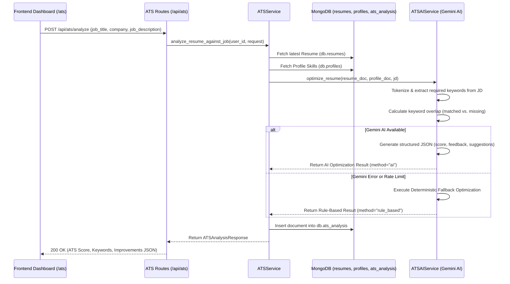

# Phase 4: AI ATS Resume Optimization Engine

## Overview
The **AI ATS Resume Optimization Engine** is Phase 4 of the OMNI Digital Twin platform. It empowers candidates to optimize their resumes against target job descriptions by calculating ATS compatibility scores, extracting matched and missing keywords, and generating actionable AI improvements for their professional summary, project descriptions, and grammar.

---

## Architecture & System Integration

The ATS Engine integrates with multiple OMNI data sources without requiring manual resume resubmission:
- **Resume Intelligence Engine (Phase 1)** (`db.resumes`): Provides the candidate's latest uploaded resume text, summary, experience, and skills.
- **User Profile** (`db.profiles`): Provides supplementary user skills.
- **Career Readiness Engine (Phase 3)** (`db.career_analysis`): Shares unified career context.



---

## Database Schema (`db.ats_analysis`)
Each document in the `ats_analysis` MongoDB collection conforms to:
```json
{
  "_id": "607f1f77bcf86cd799439001",
  "user_id": "string",
  "resume_id": "string (optional)",
  "job_title": "Senior Python Backend Engineer",
  "company": "Stripe",
  "job_description": "We are looking for Python, FastAPI, Kubernetes...",
  "required_keywords": ["Python", "Fastapi", "Kubernetes"],
  "matched_keywords": ["Python", "Fastapi"],
  "missing_keywords": ["Kubernetes"],
  "ats_score": 88,
  "resume_feedback": {
    "strengths": ["Strong FastAPI API development"],
    "weaknesses": ["Missing Kubernetes"],
    "recommendations": ["Add Kubernetes to deployment projects"],
    "section_feedback": {
      "Summary": "Highlight backend scalability.",
      "Experience": "Add metrics.",
      "Skills": "Good grouping.",
      "Projects": "Include cloud architecture."
    }
  },
  "ai_suggestions": {
    "improved_summary": "Experienced Python Backend Engineer...",
    "improved_projects": ["Built high-throughput API service using FastAPI..."],
    "grammar_feedback": ["Use action verbs."],
    "keyword_injection": ["Inject Kubernetes into project bullet points."],
    "action_verbs": ["Architected", "Engineered", "Optimized"]
  },
  "created_at": "2026-07-27T10:00:00Z"
}
```

---

## API Endpoints

### `POST /api/ats/analyze`
- **Body:** `{ "job_title": "str", "company": "str", "job_description": "str" }`
- **Description:** Analyzes the candidate's latest resume against the target job description.

### `GET /api/ats/latest`
- **Description:** Retrieves the newest ATS analysis report for the authenticated user.

### `GET /api/ats/history`
- **Description:** Retrieves the user's past ATS analyses sorted by `created_at DESC` (limit 50).

### `DELETE /api/ats/{analysis_id}`
- **Description:** Deletes a specific ATS analysis document owned by the user.

---

## Frontend Dashboard (`/ats`)
The glassmorphic **AI ATS Resume Optimizer** dashboard displays:
1. **Target Job Form**: Allows entering a target Job Title, Company, and pasting a Job Description.
2. **Hero ATS Score Gauge**: Dynamic circular 0–100 progress ring with color indicators.
3. **Keyword Audit Card**: Interactive matched vs. missing keyword chips.
4. **AI Resume Improvements**: One-click copyable optimized summary, quantified project bullet points, grammar feedback, and keyword injection strategies.
5. **Resume Feedback Card**: Clear strengths, weaknesses, and section-by-section advice.
6. **History Table**: Shows past analyses with an option to load or delete an entry.
