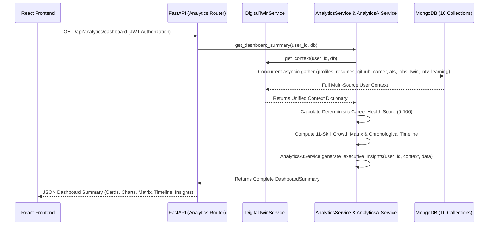

# OMNI Digital Twin — Architecture & System Design (v1.0 Production Release)

OmniMind (OMNI Digital Twin) is an AI-powered Career Operating System and Personal Digital Twin designed to aggregate a user's entire professional footprint—including uploaded resumes, GitHub repositories, developer profiles, target job descriptions, mock interviews, personalized career learning roadmaps, and executive analytics—into unified, actionable career intelligence.

---

## 1. Core Architecture Principles (v1.0 Production Release)

Version 1.0 introduces the production-ready Analytics & Career Intelligence Dashboard to provide executive command-center visibility across all 9 OMNI intelligence modules while preserving complete backward compatibility and zero regressions.

1. **Unified Executive Analytics (`AnalyticsService` & `AnalyticsAIService`)**:
   - Concurrently aggregates metrics across Profile, Resume, GitHub, Career Readiness, ATS Optimization, Job Matching, Mock Interviews, Learning Roadmaps, and Digital Twin Memory.
   - Computes a deterministic Overall Career Health Score (0–100) using transparent percentage weights without allowing LLMs to invent scoring math.
   - Generates downloadable ReportLab PDF reports (`Career Report`, `Analytics Summary`, `Progress Report`, `Career Timeline`).
2. **Persistent Living Career Representation (`digital_twin_memory`)**:
   - Continuously learns from every completed module, updating a unified career profile document per user.
   - Uses smart competency merging and deduplication for core/emerging/missing skills, recording milestone achievements and unlocked skills chronologically.
3. **Centralized User Context (`DigitalTwinService`)**:
   - Acts as the single source of truth for retrieving user context across all AI modules.
   - Concurrently fetches and aggregates documents from `profiles`, `resumes`, `github_analysis`, `career_analysis`, `ats_analysis`, `job_matches`, `interview_sessions`, `learning_roadmaps`, and `digital_twin_memory` via `asyncio.gather()`.
   - Prevents duplicate queries and inconsistent state when downstream modules require multi-source data.
4. **Standardized Schema & UTC Timekeeping**:
   - All MongoDB documents enforce mandatory metadata fields: `id` (`_id`), `user_id`, `created_at`, and `updated_at`.
   - All timestamps use timezone-aware UTC format (`datetime.now(timezone.utc)`).
5. **Deterministic Fallbacks & AI Resilience**:
   - Every AI service (`ResumeAIService`, `GitHubAIService`, `CareerAIService`, `ATSAIService`, `JobMatchingAIService`, `DigitalTwinMemoryAIService`, `InterviewAIService`, `LearningRoadmapAIService`, `AnalyticsAIService`) implements a deterministic rule-based fallback mechanism.
   - If Google Gemini AI encounters API rate limits, schema validation errors, or network timeouts, the platform gracefully switches to rule-based evaluation without failing user requests.
6. **Unified Error Handling & Environment Validation**:
   - Global exception handlers in `backend/main.py` return standardized JSON responses for `HTTPException`, `ValueError`, and unexpected runtime errors.
   - Startup environment validation ensures required configuration variables (`MONGODB_URL`, `DATABASE_NAME`, `GEMINI_API_KEY`, `JWT_SECRET_KEY`) are present and logged cleanly.

---

## 2. System Architecture Diagram

```mermaid
graph TD
    subgraph Client Layer
        UI[Frontend: React + Vite + TailwindCSS]
    end

    subgraph API Layer [FastAPI Application]
        MAIN[main.py: CORS + Global Exception Handlers]
        AUTH_ROUTER[Auth Router /api/auth]
        PROF_ROUTER[Profile Router /api/profile]
        RES_ROUTER[Resume Router /api/resumes]
        GH_ROUTER[GitHub Router /api/github]
        CAR_ROUTER[Career Router /api/career]
        ATS_ROUTER[ATS Router /api/ats]
        JOB_ROUTER[Job Matching Router /api/jobs]
        TWIN_ROUTER[Digital Twin Router /api/twin]
        INT_ROUTER[Interview Router /api/interview]
        LEARN_ROUTER[Learning Router /api/learning]
        ANALYTICS_ROUTER[Analytics Router /api/analytics]
    end

    subgraph Core Aggregation Hub
        DTS[DigitalTwinService: Single Source of Truth]
    end

    subgraph Intelligence Engines
        RES_SRV[ResumeService & ResumeAIService]
        GH_SRV[GitHubService & GitHubAIService]
        CAR_SRV[CareerService & CareerAIService]
        ATS_SRV[ATSService & ATSAIService]
        JOB_SRV[JobMatchingService & JobMatchingAIService]
        TWIN_SRV[DigitalTwinMemoryService & AIService]
        INT_SRV[InterviewService & InterviewAIService]
        LEARN_SRV[LearningRoadmapService & AIService]
        ANALYTICS_SRV[AnalyticsService & AnalyticsAIService]
    end

    subgraph Persistence Layer [MongoDB Async Motor]
        DB_USERS[(db.users)]
        DB_PROFILES[(db.profiles)]
        DB_RESUMES[(db.resumes)]
        DB_GH[(db.github_analysis)]
        DB_CAREER[(db.career_analysis)]
        DB_ATS[(db.ats_analysis)]
        DB_JOBS[(db.job_matches)]
        DB_TWIN[(db.digital_twin_memory)]
        DB_INT[(db.interview_sessions)]
        DB_LEARN[(db.learning_roadmaps)]
    end

    UI <-->|REST / JSON (JWT)| MAIN
    MAIN --> AUTH_ROUTER & PROF_ROUTER & RES_ROUTER & GH_ROUTER & CAR_ROUTER & ATS_ROUTER & JOB_ROUTER & TWIN_ROUTER & INT_ROUTER & LEARN_ROUTER & ANALYTICS_ROUTER

    RES_ROUTER --> RES_SRV
    GH_ROUTER --> GH_SRV
    CAR_ROUTER --> CAR_SRV
    ATS_ROUTER --> ATS_SRV
    JOB_ROUTER --> JOB_SRV
    TWIN_ROUTER --> TWIN_SRV
    INT_ROUTER --> INT_SRV
    LEARN_ROUTER --> LEARN_SRV
    ANALYTICS_ROUTER --> ANALYTICS_SRV

    CAR_SRV --> DTS
    ATS_SRV --> DTS
    JOB_SRV --> DTS
    TWIN_SRV --> DTS
    INT_SRV --> DTS
    LEARN_SRV --> DTS
    ANALYTICS_SRV --> DTS

    DTS <-->|asyncio.gather| DB_PROFILES & DB_RESUMES & DB_GH & DB_CAREER & DB_ATS & DB_JOBS & DB_TWIN & DB_INT & DB_LEARN
    RES_SRV <--> DB_RESUMES
    GH_SRV <--> DB_GH
    CAR_SRV <--> DB_CAREER
    ATS_SRV <--> DB_ATS
    JOB_SRV <--> DB_JOBS
    TWIN_SRV <--> DB_TWIN
    INT_SRV <--> DB_INT
    LEARN_SRV <--> DB_LEARN
    AUTH_ROUTER <--> DB_USERS
    PROF_ROUTER <--> DB_PROFILES
```

---

## 3. Data Flow & Aggregation Pipeline



---

## 4. Architectural Safeguards

- **No Schema Regressions**: Standardized Pydantic serialization models across all routes (`models/analytics.py`, `models/learning.py`, `models/interview.py`, `models/digital_twin.py`, `models/job_matching.py`, `models/ats.py`, `models/career.py`, `models/github.py`, `models/resume.py`, `models/profile.py`, `models/user.py`).
- **Complete Test Coverage**: Every module is tested via automated regression suites (`106/106` passing unit & E2E tests).
- **Graceful Error Handling**: 100% deterministic fallback rules ensure that AI service unavailability never interrupts user workflows or report exports.
