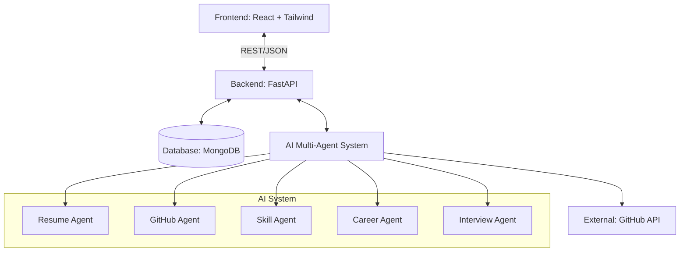

# OmniMind Architecture

OmniMind uses a microservice/agentic approach to isolate AI workflows from standard CRUD operations.

## High-Level Architecture

```mermaid
graph TD
    UI[Frontend: React + Tailwind]
    API[Backend: FastAPI]
    DB[(Database: MongoDB)]
    AI[AI Multi-Agent System]
    GH[External: GitHub API]

    UI <--> |REST/JSON| API
    API <--> DB
    API <--> AI
    AI --> GH
    
    subgraph AI System
      RA[Resume Agent]
      GA[GitHub Agent]
      SA[Skill Agent]
      CA[Career Agent]
      IA[Interview Agent]
    end
    
    AI --> RA
    AI --> GA
    AI --> SA
    AI --> CA
    AI --> IA
```
