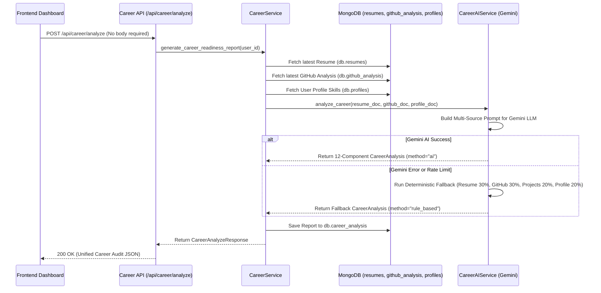

# Phase 3: AI Career Readiness Engine (OMNI Core Intelligence)

## Overview
The **AI Career Readiness Engine** is the central intelligence layer of the OMNI Digital Twin platform. It automatically aggregates and synthesizes the candidate's professional footprint across multiple independent sources:
- **AI Resume Intelligence Engine (Phase 1)** -> `db.resumes`
- **AI GitHub Intelligence Engine (Phase 2)** -> `db.github_analysis`
- **User Profile & Core Database** -> `db.profiles`, `db.users`

Without requiring any manual data resubmission from the frontend, it combines these sources into a unified AI career audit using Google Gemini (`LLMProvider`), generating a 12-component career report stored in `db.career_analysis`.

---

## System Architecture & Sequence Diagram



---

## 12-Component AI Career Readiness Report

1. **Overall Career Score (`0-100`)**: Consolidated score representing placement readiness.
2. **Technical Score (`0-100`)**: Evaluates programming languages, frameworks, AI, backend, and database skills.
3. **Resume Score (`0-100`)**: ATS readiness, project depth, and experience clarity.
4. **GitHub Score (`0-100`)**: Reuses public GitHub repository quality, stars, and commit footprint.
5. **Project Score (`0-100`)**: Assesses project complexity, architecture, and system design.
6. **Communication Score (`0-100`)**: Evaluates documentation quality, README clarity, and teamwork.
7. **Career Level (`str`)**: Categorized as `Beginner`, `Intermediate`, `Placement Ready`, or `Advanced`.
8. **Strengths (`List[str]`)**: Core competencies (e.g., `["Python", "FastAPI", "REST APIs", "Machine Learning"]`).
9. **Weaknesses (`List[str]`)**: Areas for growth (e.g., `["Testing", "Docker", "Cloud", "CI/CD"]`).
10. **Missing Skills (`List[str]`)**: Missing technologies relative to desired career profile (e.g., `["Docker", "Redis", "AWS", "Kubernetes"]`).
11. **Recommended Roles (`List[str]`)**: Target roles matching profile (e.g., `["Backend Developer", "Python Developer", "AI Engineer"]`).
12. **Career Summary (`str`)**: Executive paragraph summarizing technical capability and placement readiness.

---

## Rule-Based Fallback Weighting
If the LLM provider fails, times out, or rate limits, the engine executes `fallback_rule_based_career(...)` with deterministic weighting:
```text
Resume      30%
GitHub      30%
Projects    20%
Profile     20%
```

---

## API Endpoints

### Phase 3 Endpoints
- `POST /api/career/analyze`: Automatically loads latest MongoDB data, runs AI Career Readiness Engine, stores report in `db.career_analysis`, and returns `CareerAnalyzeResponse`.
- `GET /api/career/latest`: Retrieves the newest report for the authenticated user from `db.career_analysis`.
- `GET /api/career/history`: Retrieves previous career readiness analyses sorted by newest first (`created_at DESC`).

### Legacy ATS Compatibility
- `POST /api/career/analyze` (with `{ job_title, job_description }` body): Executes legacy ATS keyword matching against `db.career_reports`.
- `POST /api/career/job-match`: Explicit legacy ATS matching endpoint.
- `GET /api/career/reports`: Retrieves legacy ATS reports.
