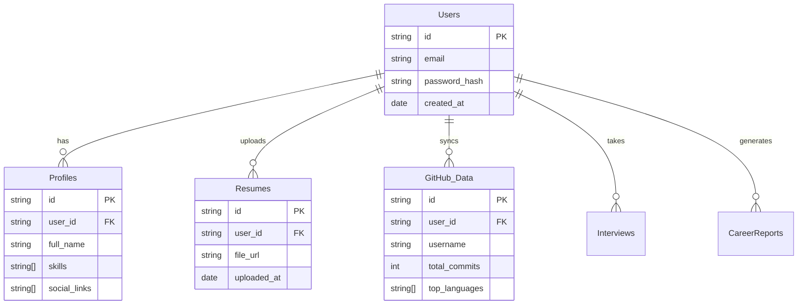

# OmniMind Database Design

## Entity-Relationship Diagram

```mermaid
erDiagram
    Users ||--o{ Profiles : has
    Users ||--o{ Resumes : uploads
    Users ||--o{ GitHub_Data : syncs
    Users ||--o{ Interviews : takes
    Users ||--o{ CareerReports : generates
    
    Users {
        string id PK
        string email
        string password_hash
        date created_at
    }
    
    Profiles {
        string id PK
        string user_id FK
        string full_name
        string[] skills
        string[] social_links
    }
    
    Resumes {
        string id PK
        string user_id FK
        string file_url
        date uploaded_at
    }
    
    GitHub_Data {
        string id PK
        string user_id FK
        string username
        int total_commits
        string[] top_languages
    }
```
