# OMNI Digital Twin Database Design

## Entity-Relationship Diagram

*Note: The v1.0 Executive Analytics Dashboard is a read-only aggregation layer that queries and synthesizes data from all collections below concurrently via `DigitalTwinService` without maintaining its own database collection.*

```mermaid
erDiagram
    Users ||--o{ Profiles : "has (1:1)"
    Users ||--o{ Resumes : "uploads (1:N)"
    Users ||--o{ GitHub_Analysis : "syncs (1:N)"
    Users ||--o{ Career_Analysis : "evaluates (1:N)"
    Users ||--o{ ATS_Analysis : "optimizes (1:N)"
    Users ||--o{ Job_Matches : "matches (1:N)"
    Users ||--|| Digital_Twin_Memory : "evolves (1:1)"
    Users ||--o{ Interview_Sessions : "interviews (1:N)"
    Users ||--o{ Learning_Roadmaps : "learns (1:N)"
    
    Users {
        ObjectId _id PK
        string email
        string hashed_password
        date created_at
        date updated_at
    }
    
    Profiles {
        ObjectId _id PK
        string user_id FK
        string full_name
        string bio
        string[] skills
        string[] social_links
        date created_at
        date updated_at
    }
    
    Resumes {
        ObjectId _id PK
        string user_id FK
        string file_path
        string file_name
        object parsed_data
        date created_at
        date updated_at
    }
    
    GitHub_Analysis {
        ObjectId _id PK
        string user_id FK
        string username
        string[] top_languages
        object portfolio_analysis
        date created_at
        date updated_at
    }
    
    Career_Analysis {
        ObjectId _id PK
        string user_id FK
        int overall_readiness_score
        string career_level
        string[] strengths
        string[] weaknesses
        date created_at
        date updated_at
    }

    ATS_Analysis {
        ObjectId _id PK
        string user_id FK
        string job_description
        int ats_match_percentage
        string[] matched_keywords
        string[] missing_keywords
        string[] optimization_suggestions
        date created_at
        date updated_at
    }

    Job_Matches {
        ObjectId _id PK
        string user_id FK
        string job_description
        string role_title
        string company_name
        int fit_score
        int technical_fit_score
        string[] missing_skills
        date created_at
        date updated_at
    }

    Digital_Twin_Memory {
        ObjectId _id PK
        string user_id FK
        string current_role
        string[] target_roles
        string[] core_skills
        string[] emerging_skills
        string[] missing_skills
        object[] timeline
        object metadata
        date created_at
        date updated_at
    }

    Interview_Sessions {
        ObjectId _id PK
        string user_id FK
        string role
        string company
        string difficulty
        string interview_type
        string status
        object[] questions
        object[] answers
        object[] evaluations
        object report
        int overall_score
        int technical_score
        int communication_score
        int confidence_score
        date created_at
        date updated_at
    }

    Learning_Roadmaps {
        ObjectId _id PK
        string user_id FK
        string target_role
        int current_readiness
        int target_readiness
        object roadmap
        object[] milestones
        string[] completed_items
        float progress_percentage
        string estimated_completion
        date created_at
        date updated_at
    }
```

## MongoDB Collections & Index Definitions

All OMNI collections adhere to the following strict rules:
- All documents require `_id`, `user_id`, `created_at`, `updated_at`.
- Timestamps use UTC (`datetime.now(timezone.utc)`).
- Compound indexes ensure optimal query performance for user-scoped lookups.

### Indexes Registered via `backend/database/indexes.py`
- **users**: `[("email", 1)]` (unique=True)
- **profiles**: `[("user_id", 1)]` (unique=True)
- **resumes**: `[("user_id", 1), ("created_at", -1)]`
- **github_analysis**: `[("user_id", 1), ("created_at", -1)]`
- **career_analysis**: `[("user_id", 1), ("created_at", -1)]`
- **ats_analysis**: `[("user_id", 1), ("created_at", -1)]`
- **job_matches**: `[("user_id", 1), ("created_at", -1)]`
- **digital_twin_memory**: `[("user_id", 1)]` (unique=True)
- **interview_sessions**: `[("user_id", 1), ("created_at", -1)]`
- **learning_roadmaps**: `[("user_id", 1), ("created_at", -1)]`
