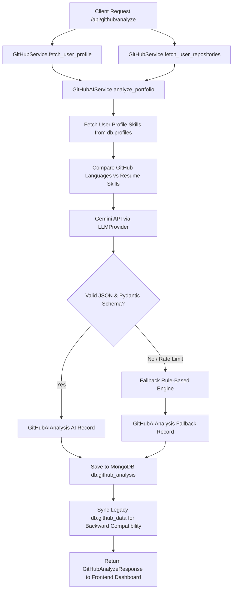

# Phase 2: AI GitHub Intelligence Engine

## Overview
The **AI GitHub Intelligence Engine** is a core component of the OMNI Digital Twin platform. It interacts with the GitHub REST API to ingest candidate profile statistics, repository footprints, and README metadata, and combines them with Gemini LLM (`LLMProvider`) analysis to generate an engineering audit of the candidate's software portfolio.

---

## System Architecture & Workflow

---

## 9 Structured AI Components (`GitHubAIAnalysis`)
The AI engine produces a 9-component structured analysis validated against strict Pydantic schemas:
1. **Developer Level**: Categorizes maturity (`Junior`, `Mid-Level`, `Senior`, `Lead`).
2. **GitHub Score (`0-100`)**: Evaluates repository consistency, stars, forks, and architectural complexity.
3. **Strengths (`List[str]`)**: Identifies core engineering competencies.
4. **Weaknesses (`List[str]`)**: Pinpoints areas for architectural or testing improvements.
5. **Portfolio Review (`str`)**: 3–4 sentence executive evaluation of the developer's public codebase.
6. **Repository Analysis (`List[RepositoryAnalysisItem]`)**: Detailed breakdown per repository, including quality score (0–100), architecture score, tech stack, and summary.
7. **Career Recommendations (`List[str]`)**: High-leverage actions to boost engineering trajectory.
8. **Missing Skills (`List[str]`)**: Comparative audit between public GitHub footprint and skills listed on the user's Resume (`db.profiles`).
9. **Personalized Learning Roadmap (`List[RoadmapStepItem]`)**: Step-by-step learning milestones with recommended resources.

---

## API Endpoints

### 1. Phase 2 Endpoints
- **`POST /api/github/analyze`**: Runs live API ingestion + AI analysis for `{ username }` and persists to MongoDB.
- **`GET /api/github/latest`**: Retrieves the most recent `GitHubAnalyzeResponse` report from `db.github_analysis`.
- **`GET /api/github/profile`**: Retrieves stored `GitHubProfileInfo`.
- **`GET /api/github/repos`**: Retrieves stored list of `RepositoryInfo`.

### 2. Legacy Endpoints (Preserved for Backward Compatibility)
- **`POST /api/github/sync`**: Syncs repository counts and languages to `db.github_data`.
- **`GET /api/github/report`**: Retrieves `GitHubDataResponse` from `db.github_data`.
